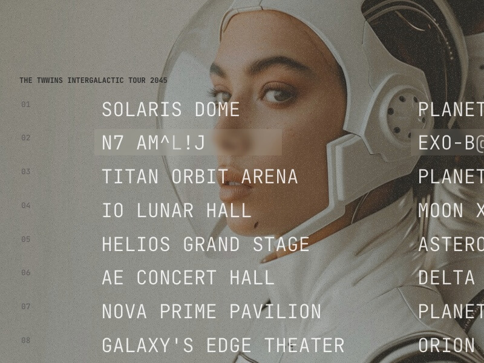

## Summary
Some fun Terminal-like character hover animations for lines of text.

## Key Details
- **Source:** [tympanus.net](https://tympanus.net/codrops/2024/06/19/hover-animations-for-terminal-like-typography/)
- **Title:** Hover Animations for Terminal-like Typography | Codrops
- **Description:** Some fun Terminal-like character hover animations for lines of text.

## Visual Assets

