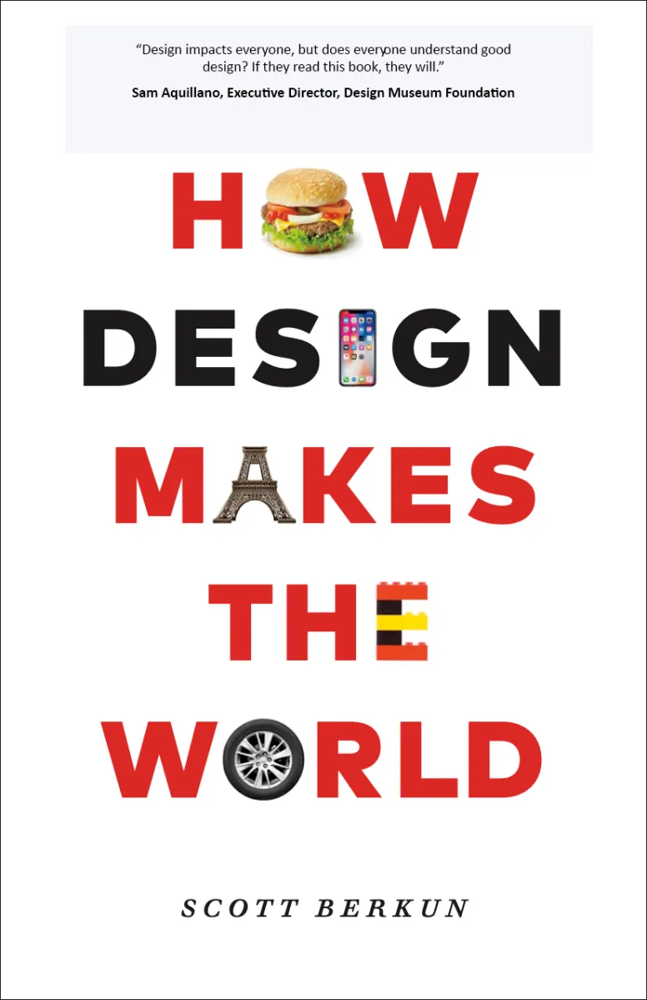

## Summary
[Buy on Amazon - Bookshop - Apple Books - IndieBound - Barnes & Nobles - Smashwords - Bulk sales] Everything we use, from social media, to our homes, to our highways, was designed by someone. What did

## Key Details
- **Source:** [designmtw.com](https://designmtw.com/)
- **Title:** How Design MAKES THE WORLD (The book)
- **Description:** [Buy on Amazon - Bookshop - Apple Books - IndieBound - Barnes & Nobles - Smashwords - Bulk sales] Everything we use, from social media, to our homes, 

## Visual Assets

