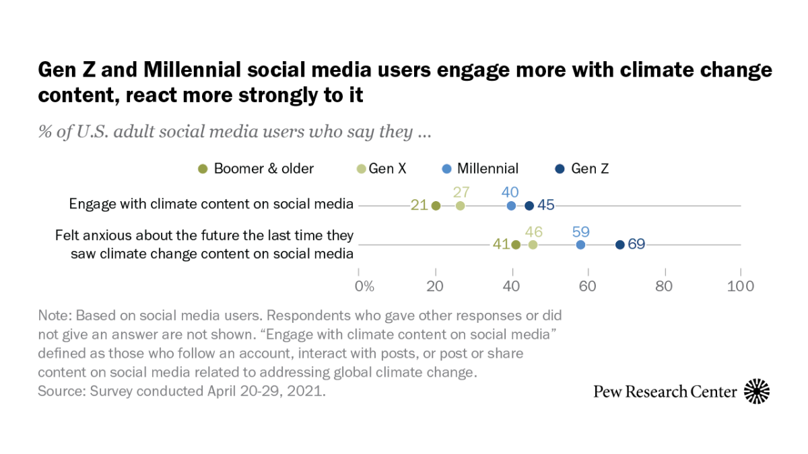

## Summary
Among U.S. social media users, 45% of Gen Z adults have interacted with content that focuses on the need for action on climate change.

## Key Details
- **Source:** [pewresearch.org](https://www.pewresearch.org/short-reads/2021/06/21/on-social-media-gen-z-and-millennial-adults-interact-more-with-climate-change-content-than-older-generations/)
- **Title:** How Gen Zers, Millennials react to climate change content on social media | Pew Research Center
- **Description:** Among U.S. social media users, 45% of Gen Z adults have interacted with content that focuses on the need for action on climate change.

## Visual Assets

