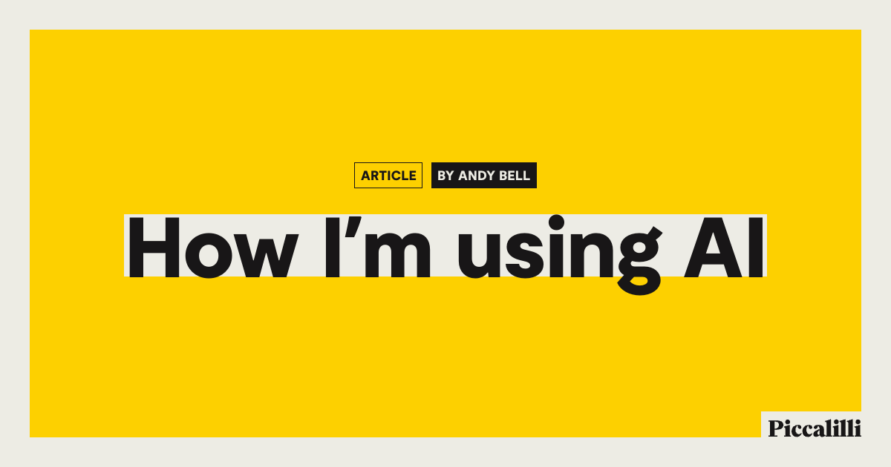

## Summary
An honest roundup of what I personally think of AI and how it genuinely has its uses in my day-to-day work.

## Key Details
- **Source:** [piccalil.li](https://piccalil.li/blog/how-im-using-ai/)
- **Title:** How I’m using AI
- **Description:** An honest roundup of what I personally think of AI and how it genuinely has its uses in my day-to-day work.

## Visual Assets

