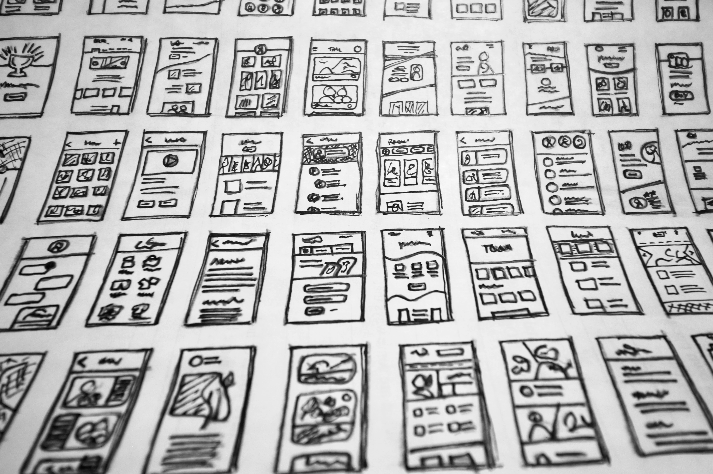

## Summary
Updated: 18 Sept 2023 We help Shopify merchants improve their web performance and see three common problems related to layout position: Lazy loading images above the fold Asynchronous loading of CSS n

## Key Details
- **Source:** [performance.shopify.com](https://performance.shopify.com/blogs/blog/how-layout-position-impacts-three-big-web-performance-levers)
- **Title:** How layout position impacts three big web performance levers
- **Description:** Updated: 18 Sept 2023 We help Shopify merchants improve their web performance and see three common problems related to layout position: Lazy loading i

## Visual Assets

