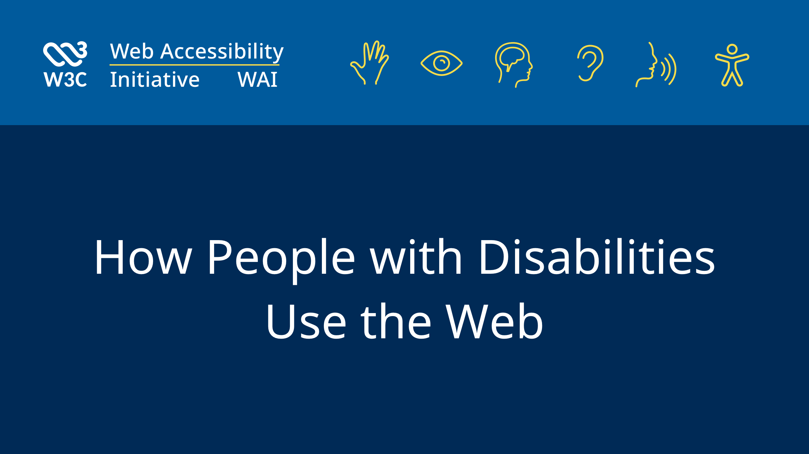

## Summary
Introduces how people with disabilities, including people with age-related impairments, use the Web.

## Key Details
- **Source:** [w3.org](https://www.w3.org/WAI/people-use-web/)
- **Title:** How People with Disabilities Use the Web
- **Description:** Introduces how people with disabilities, including people with age-related impairments, use the Web.

## Visual Assets

