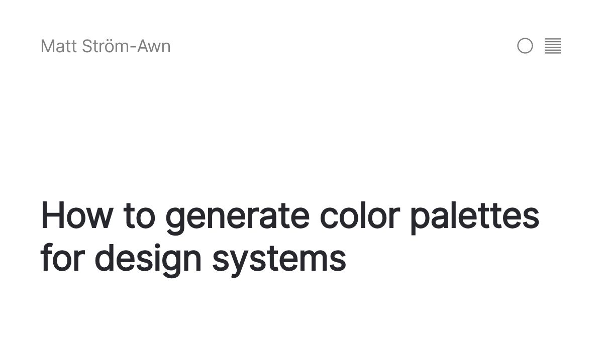

## Summary
A guide on how to generate color palettes for design systems

## Key Details
- **Source:** [matthewstrom.com](https://matthewstrom.com/writing/generating-color-palettes/)
- **Title:** How to generate color palettes for design systems
- **Description:** A guide on how to generate color palettes for design systems

## Visual Assets

