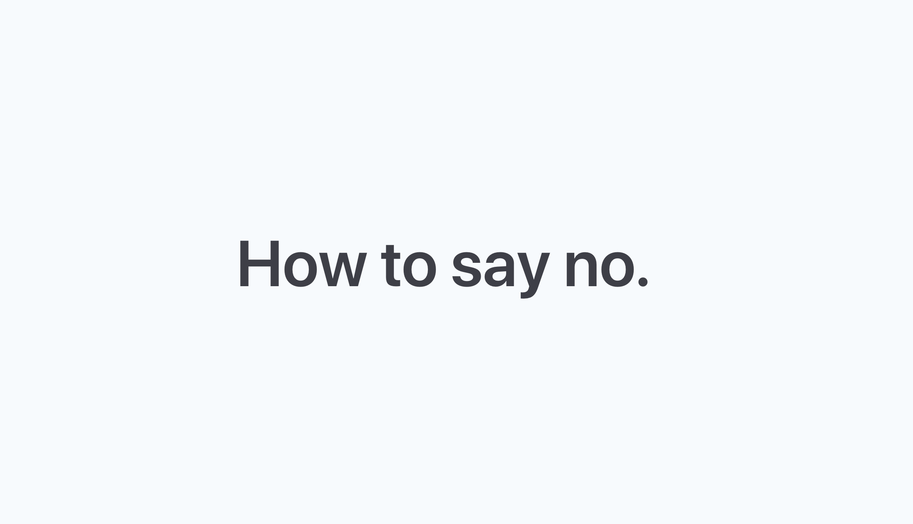

## Summary
Saying no is hard, but it's also essential for your sanity. Here are some templates for how to say no - so you can take back your life.

## Key Details
- **Source:** [starterstory.com](https://www.starterstory.com/how-to-say-no?ref=producthunt)
- **Title:** How To Say No
- **Description:** Saying no is hard, but it's also essential for your sanity. Here are some templates for how to say no - so you can take back your life.

## Visual Assets

