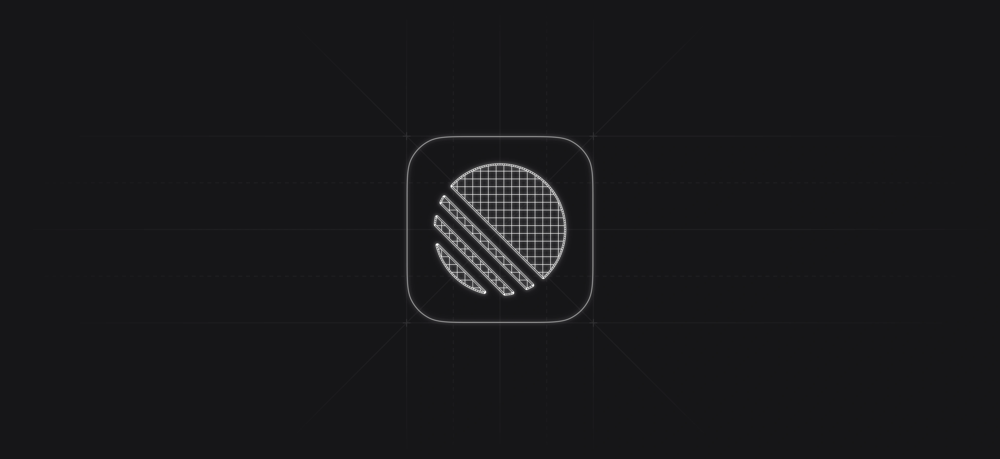

## Summary
Saved from linear.app: How we redesigned the Linear UI (part Ⅱ) - Linear

## Key Details
- **Source:** [linear.app](https://linear.app/blog/how-we-redesigned-the-linear-ui)
- **Title:** How we redesigned the Linear UI (part Ⅱ) - Linear

## Visual Assets

