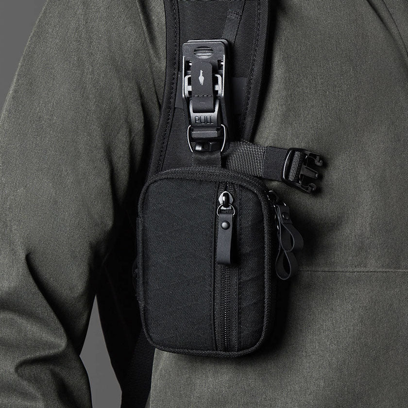

## Summary
Shop from the premium tech pocuh from Alpaka at Modern Quests. Durable and versatile this tech pouch let you securely carry your all all electronics. Safely store cables, chargers, and accessories for

## Key Details
- **Source:** [modernquests.com](https://modernquests.com/products/hub-pouch-black-vx42)
- **Title:** Hub Tech Pouch - Black VX42
- **Description:** Shop from the premium tech pocuh from Alpaka at Modern Quests. Durable and versatile this tech pouch let you securely carry your all all electronics. 

## Visual Assets

