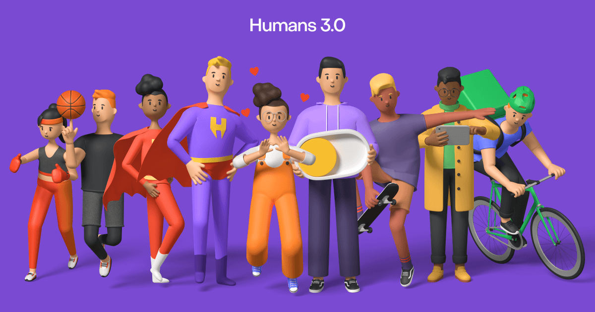

## Summary
The biggest set of 3D characters for Figma and Blender. With 12 animated illustrations. 4 different outfits. Changeable colors. Great for UI projects.

## Key Details
- **Source:** [humans.wannathis.one](https://humans.wannathis.one/)
- **Title:** Humans 3d characters with animated super heroes
- **Description:** The biggest set of 3D characters for Figma and Blender. With 12 animated illustrations. 4 different outfits. Changeable colors. Great for UI projects.

## Visual Assets

