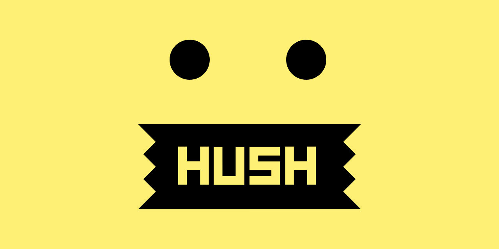

## Summary
Block nags to accept cookies and privacy
 invasive tracking in Safari on Mac, iPhone and iPad.

## Key Details
- **Source:** [oblador.github.io](https://oblador.github.io/hush/?ref=producthunt)
- **Title:** Hush - Noiseless Browsing
- **Description:** Block nags to accept cookies and privacy
 invasive tracking in Safari on Mac, iPhone and iPad.

## Visual Assets

