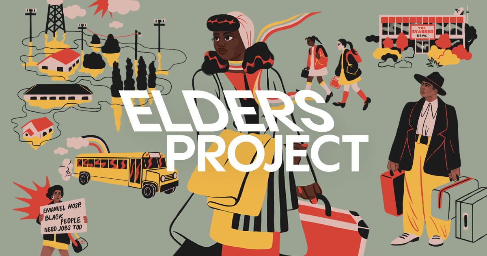

## Summary
The Baldwin-Emerson Elders Project captures and celebrates the untold stories of activists, storytellers, and community builders who have witnessed and shaped monumental change in American public life

## Key Details
- **Source:** [eldersproject.incite.columbia.edu](https://eldersproject.incite.columbia.edu/)
- **Title:** I See My Light Shining
- **Description:** The Baldwin-Emerson Elders Project captures and celebrates the untold stories of activists, storytellers, and community builders who have witnessed an

## Visual Assets

