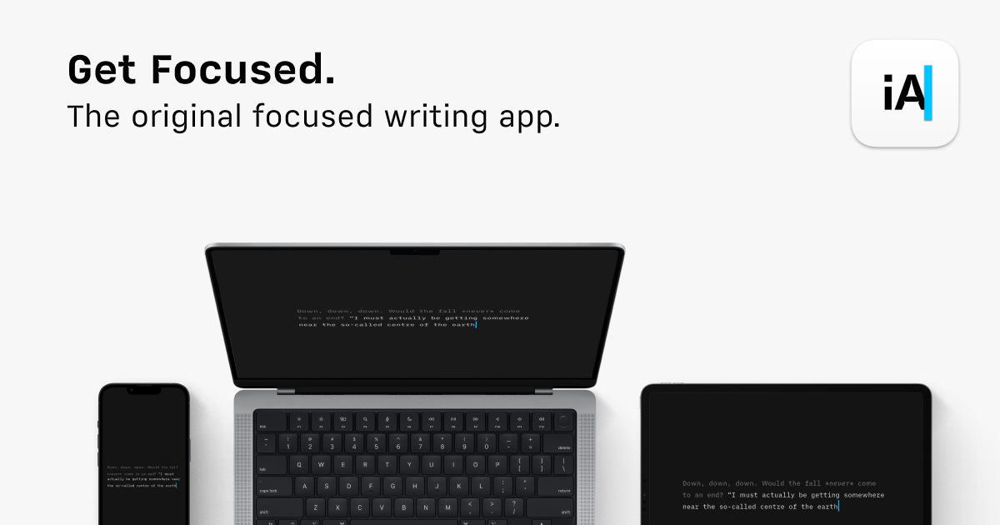

## Summary
Plain text. Total focus. The Industry standard Markdown text editor. Available for Mac, iPhone, iPad, Android, and Windows. Download it now, try it for free

## Key Details
- **Source:** [ia.net](https://ia.net/writer)
- **Title:** iA Writer: The Benchmark of Markdown Writing Apps
- **Description:** Plain text. Total focus. The Industry standard Markdown text editor. Available for Mac, iPhone, iPad, Android, and Windows. Download it now, try it fo

## Visual Assets

