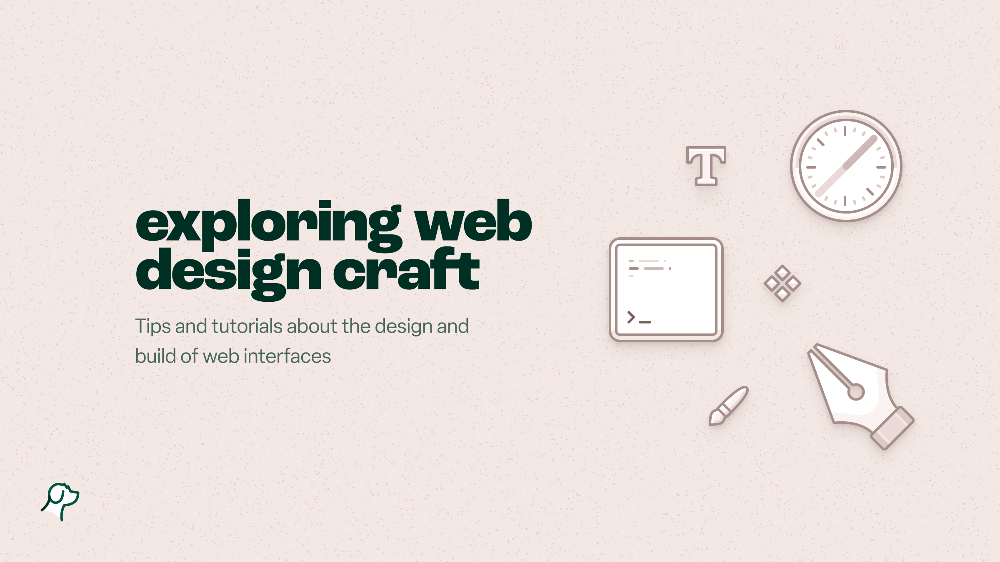

## Summary
A blog by Steve McKinney about the design and build of websites. Bridging the gap between your design tool and code, with a focus on typography, CSS and visual craft.

## Key Details
- **Source:** [iamsteve.me](https://iamsteve.me/)
- **Title:** iamsteve • design & code blog
- **Description:** A blog by Steve McKinney about the design and build of websites. Bridging the gap between your design tool and code, with a focus on typography, CSS a

## Visual Assets

