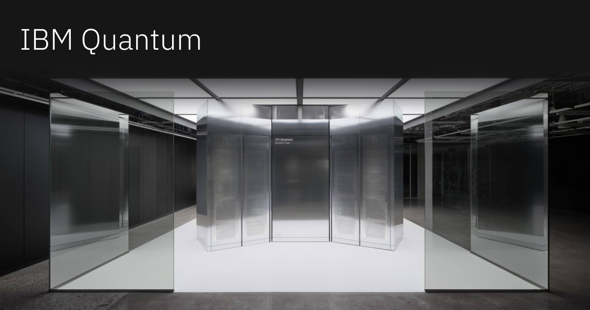

## Summary
IBM Quantum is providing the most advanced quantum computing hardware and software – and partners with the largest ecosystem to bring useful quantum computing to the world.

## Key Details
- **Source:** [ibm.com](https://www.ibm.com/quantum)
- **Title:** IBM Quantum Computing | Home 
- **Description:** IBM Quantum is providing the most advanced quantum computing hardware and software – and partners with the largest ecosystem to bring useful quantum c

## Visual Assets

