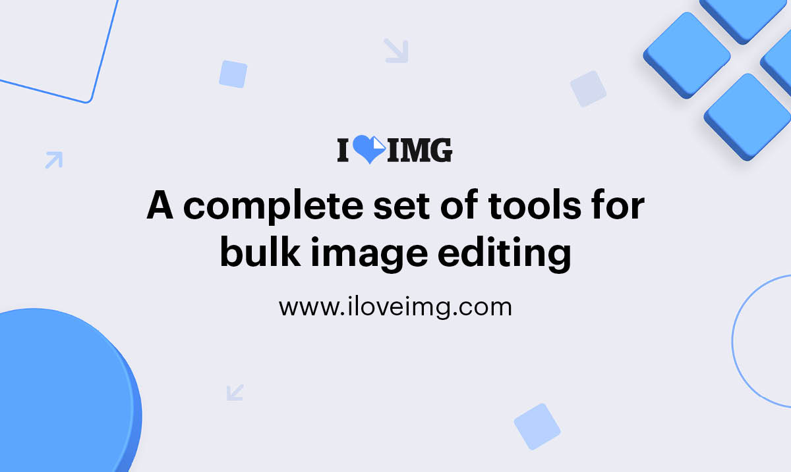

## Summary
iLoveIMG is the webapp that lets you modify images in seconds for free. Crop, resize, compress, convert, and more in just a few clicks!

## Key Details
- **Source:** [iloveimg.com](https://www.iloveimg.com/)
- **Title:** iLoveIMG | The fastest free web app for easy image modification.
- **Description:** iLoveIMG is the webapp that lets you modify images in seconds for free. Crop, resize, compress, convert, and more in just a few clicks!

## Visual Assets

