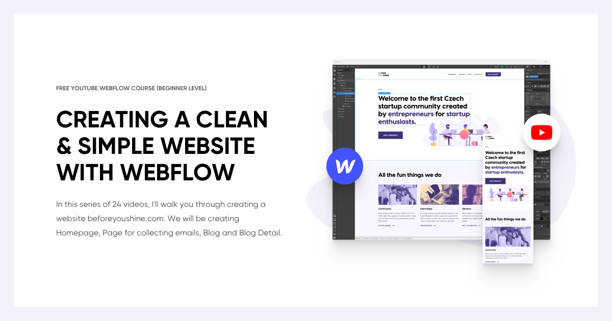

## Summary
In this series of 24 videos, I'll walk you through creating a website beforeyoushine.com. We will be creating Homepage, Page for collecting emails, Blog and Blog Detail. And in the new update, I'll te

## Key Details
- **Source:** [janlosert.com](https://www.janlosert.com/webflow-course-simple-website)
- **Title:** In this series of 24 videos, I'll walk you through creating a website beforeyoushine.com. We will be creating Homepage, Page for collecting emails, Blog and Blog Detail. And in the new update, I'll teach you how to create a Job Board with Webflow!
- **Description:** In this series of 24 videos, I'll walk you through creating a website beforeyoushine.com. We will be creating Homepage, Page for collecting emails, Bl

## Visual Assets

