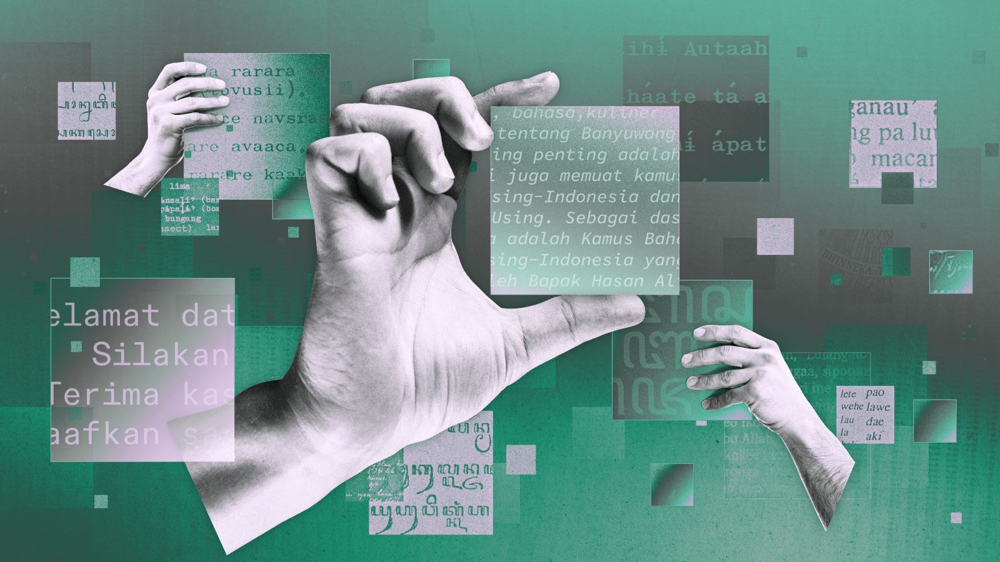

## Summary
Most LLMs such as GPT, Llama, and Gemini are trained largely in English, but several Southeast Asian firms are focusing on Bahasa Indonesia and other regional languages.

## Key Details
- **Source:** [restofworld.org](https://restofworld.org/2024/indonesia-ai-700-langagues/)
- **Title:** Indonesia has more than 700 languages. Can AI save them?
- **Description:** Most LLMs such as GPT, Llama, and Gemini are trained largely in English, but several Southeast Asian firms are focusing on Bahasa Indonesia and other 

## Visual Assets

