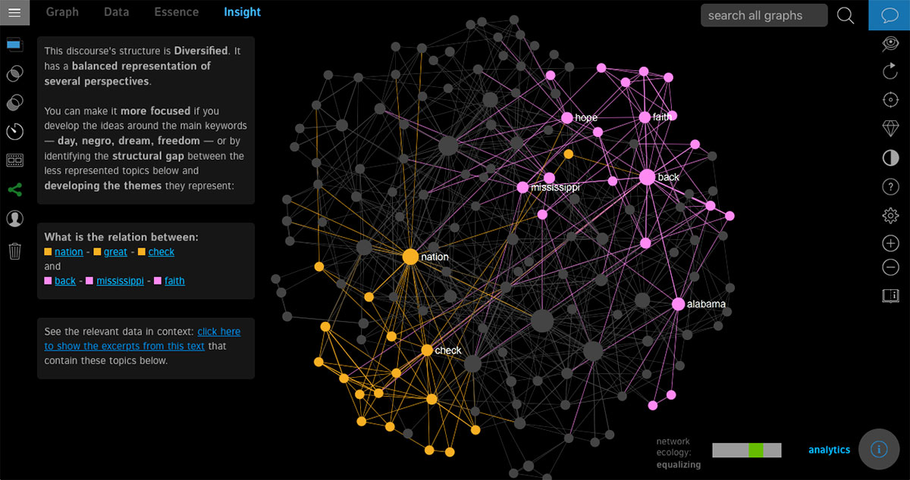

## Summary
Use AI and knowledge graphs to get insight from any text and to detect blind spots in ideas.

## Key Details
- **Source:** [infranodus.com](https://infranodus.com/)
- **Title:** InfraNodus: AI Text Analysis & Insight Tool for Research and Exploration
- **Description:** Use AI and knowledge graphs to get insight from any text and to detect blind spots in ideas.

## Visual Assets

