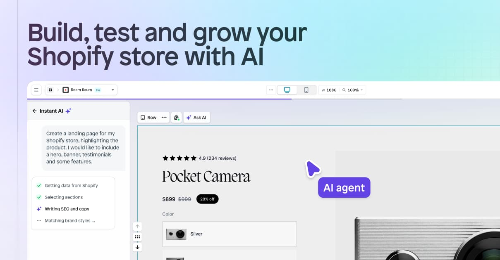

## Summary
Build, test, and launch your store in minutes with Instant’s AI page builder. Prompt to design any page your store needs. Available on the Shopify app store.

## Key Details
- **Source:** [instant.so](https://instant.so/)
- **Title:** Instant AI Shopify Store Builder | No code page building
- **Description:** Build, test, and launch your store in minutes with Instant’s AI page builder. Prompt to design any page your store needs. Available on the Shopify app

## Visual Assets

