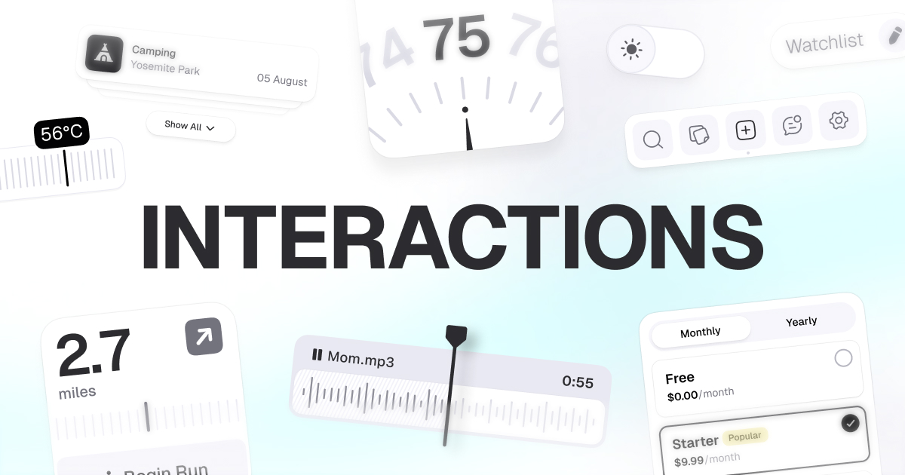

## Summary
Handcrafted interactions focused on utility & beauty.

## Key Details
- **Source:** [khagwal.com](https://khagwal.com/interactions/)
- **Title:** Interactions by Nitish Khagwal
- **Description:** Handcrafted interactions focused on utility & beauty.

## Visual Assets

