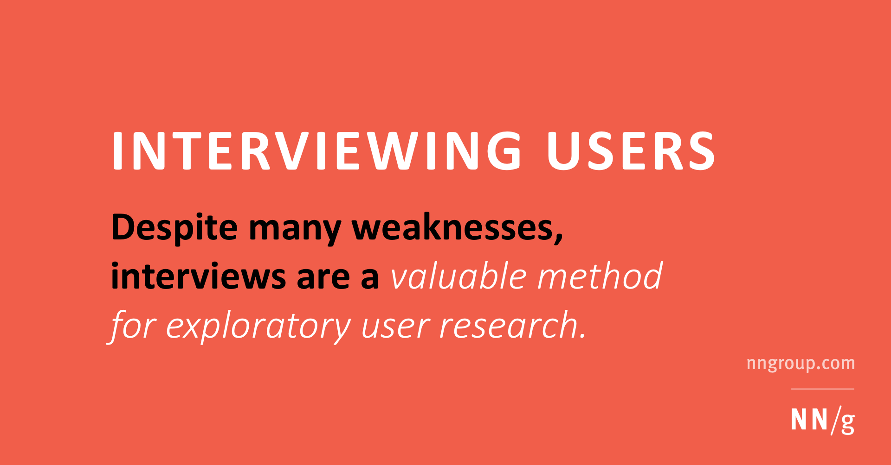

## Summary
Despite many weaknesses, interviews are a valuable method for exploratory user research.

## Key Details
- **Source:** [nngroup.com](https://www.nngroup.com/articles/interviewing-users/?lm=interview-guide&pt=article)
- **Title:** Interviewing Users
- **Description:** Despite many weaknesses, interviews are a valuable method for exploratory user research.

## Visual Assets

