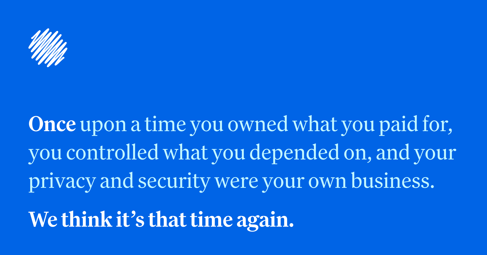

## Summary
Once upon a time you owned what you paid for, you controlled what you depended on, and your privacy and security were your own business. We think it’s that time again.

## Key Details
- **Source:** [once.com](https://once.com/)
- **Title:** Introducing ONCE
- **Description:** Once upon a time you owned what you paid for, you controlled what you depended on, and your privacy and security were your own business. We think it’s

## Visual Assets

