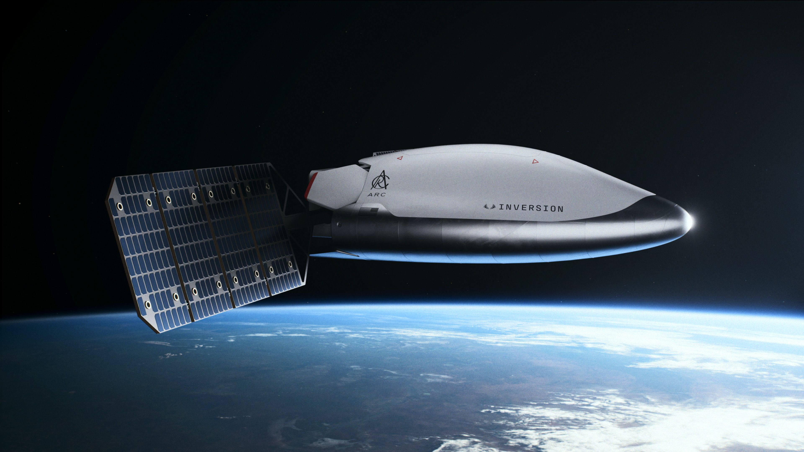

## Summary
Making Space a Transportation Layer for Earth. 

## Key Details
- **Source:** [inversionspace.com](https://www.inversionspace.com/)
- **Title:** Inversion
- **Description:** Making Space a Transportation Layer for Earth. 

## Visual Assets

