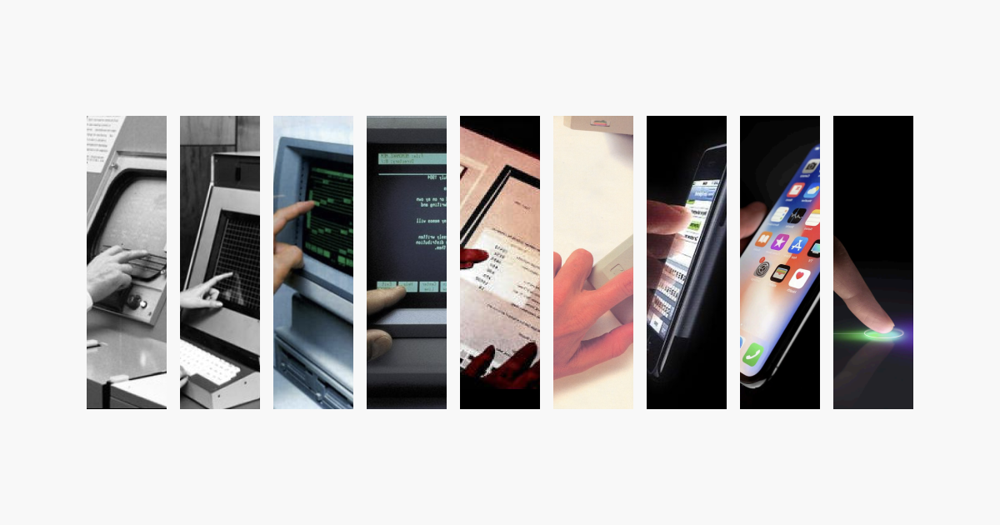

## Summary
What makes great interactions feel right?

## Key Details
- **Source:** [rauno.me](https://rauno.me/craft/interaction-design#metaphors)
- **Title:** Invisible Details of Interaction Design
- **Description:** What makes great interactions feel right?

## Visual Assets

