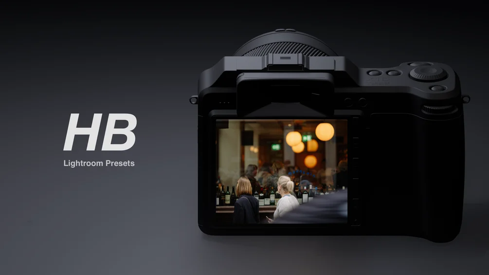

## Summary
Are you struggling to get the perfect colour and tone in your photos? After purchasing a Hasselblad camera, I realised I wasn't happy with the default colour rendering. I wasn’t alone—many friends fac

## Key Details
- **Source:** [novikoff.gumroad.com](https://novikoff.gumroad.com/l/HBPresets)
- **Title:** iPhone & Camera RAW Lightroom Presets - Hasselblad Inspired
- **Description:** Are you struggling to get the perfect colour and tone in your photos? After purchasing a Hasselblad camera, I realised I wasn't happy with the default

## Visual Assets

