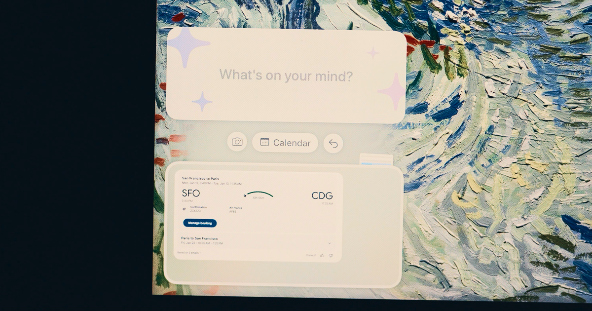

## Summary
Iris is an intelligent assistant that works across all your apps. Tell it what you need, and it handles the rest.

## Key Details
- **Source:** [iris.fun](https://iris.fun/)
- **Title:** Iris
- **Description:** Iris is an intelligent assistant that works across all your apps. Tell it what you need, and it handles the rest.

## Visual Assets

