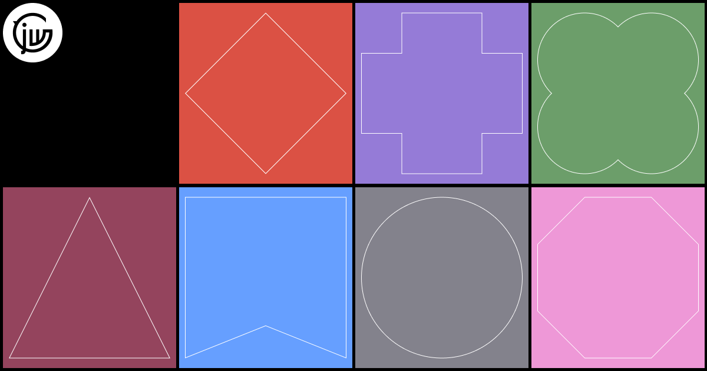

## Summary
An illustration and animation agency representing world-class artists across Australia, the US, and the UK. Trusted since 2007.

## Key Details
- **Source:** [jackywinter.com](https://www.jackywinter.com/)
- **Title:** Jacky Winter
- **Description:** An illustration and animation agency representing world-class artists across Australia, the US, and the UK. Trusted since 2007.

## Visual Assets

