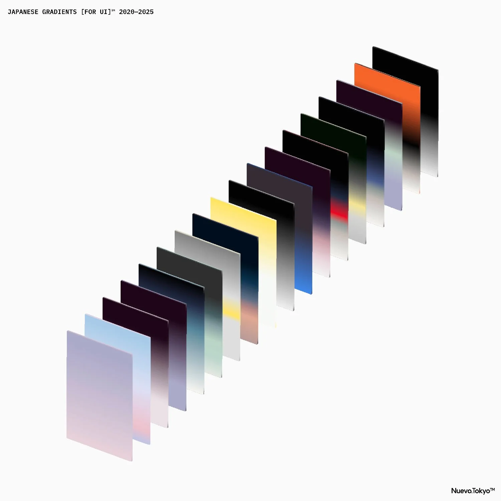

## Summary
JAPANESE GRADIENTS [FOR UI]™ by Nuevo.Tokyo™ is a curated set of high-res gradients inspired by traditional Japanese colours. These collections blends cultural heritage with modern UI design for web, 

## Key Details
- **Source:** [nuevo.tokyo](https://www.nuevo.tokyo/japanese-gradients-for-ui)
- **Title:** Japanese Gradients  [For UI]™ — Nuevo.Tokyo™
- **Description:** JAPANESE GRADIENTS [FOR UI]™ by Nuevo.Tokyo™ is a curated set of high-res gradients inspired by traditional Japanese colours. These collections blends

## Visual Assets

