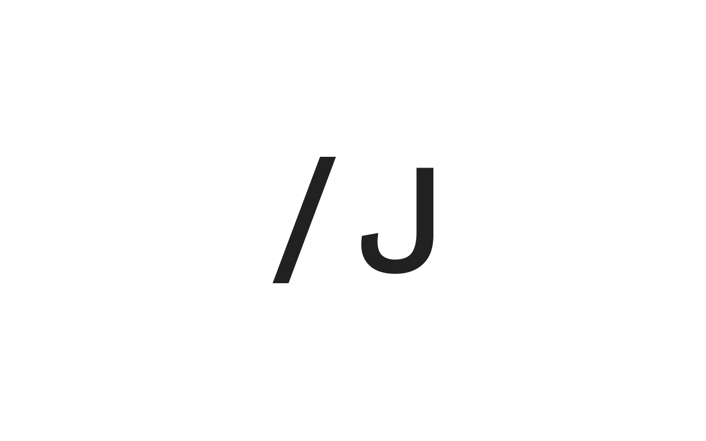

## Summary
 UX designer based in Seoul, Korea. 

## Key Details
- **Source:** [joannelee.kr](https://joannelee.kr/en/)
- **Title:**  Joanne Lee | UX designer based in Seoul, Korea. 
- **Description:**  UX designer based in Seoul, Korea. 

## Visual Assets

