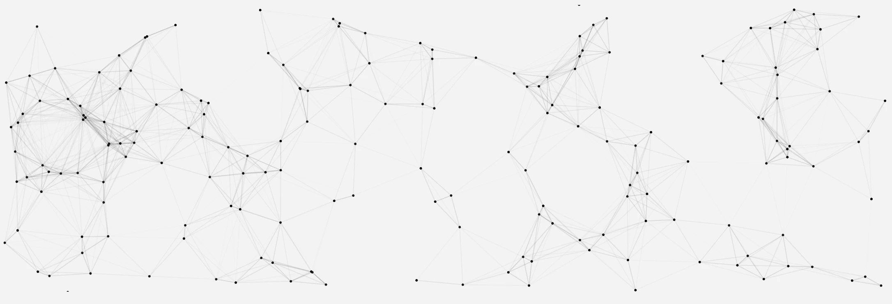

## Summary
Thoughts on systems, design and the management of both

## Key Details
- **Source:** [jonlax.framer.ai](https://jonlax.framer.ai/)
- **Title:** Jon Lax | Collected Thoughts
- **Description:** Thoughts on systems, design and the management of both

## Visual Assets

