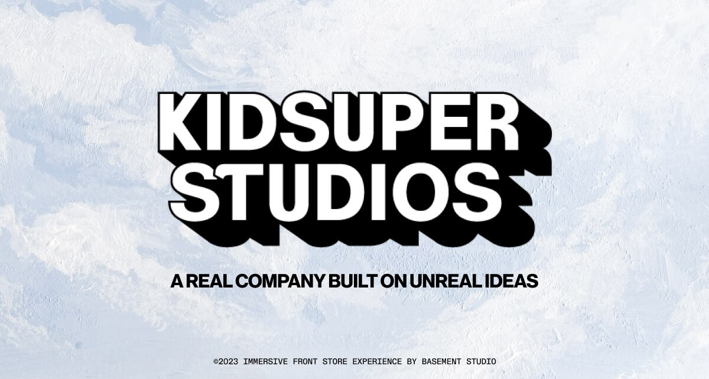

## Summary
A real company built on unreal ideas.

## Key Details
- **Source:** [kidsuper.world](https://kidsuper.world/)
- **Title:** KidSuper World
- **Description:** A real company built on unreal ideas.

## Visual Assets

