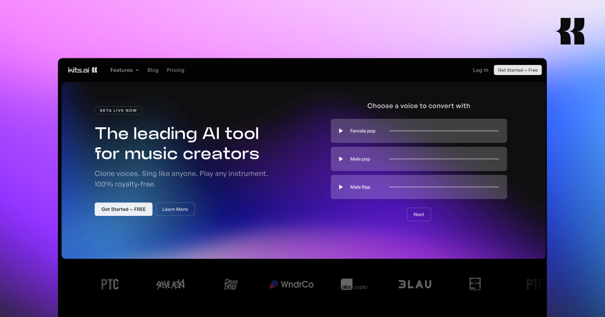

## Summary
Kits streamlines and improves producer workflows with AI audio tools built for music. Clone AI voice generators. Sing like anyone. Play any instrument. 100% royalty-free.

## Key Details
- **Source:** [kits.ai](https://www.kits.ai/)
- **Title:** Kits AI - Studio-quality AI music tools
- **Description:** Kits streamlines and improves producer workflows with AI audio tools built for music. Clone AI voice generators. Sing like anyone. Play any instrument

## Visual Assets

