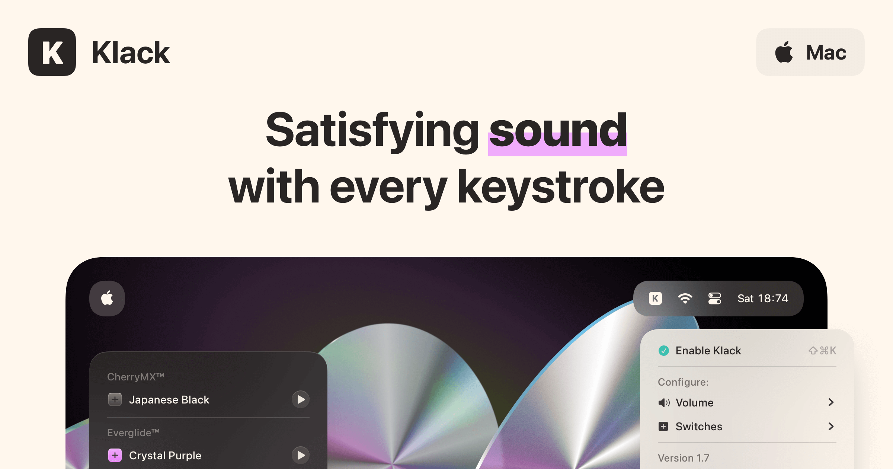

## Summary
Satisfying sound with every keystroke

## Key Details
- **Source:** [tryklack.com](https://tryklack.com/)
- **Title:** Klack
- **Description:** Satisfying sound with every keystroke

## Visual Assets

