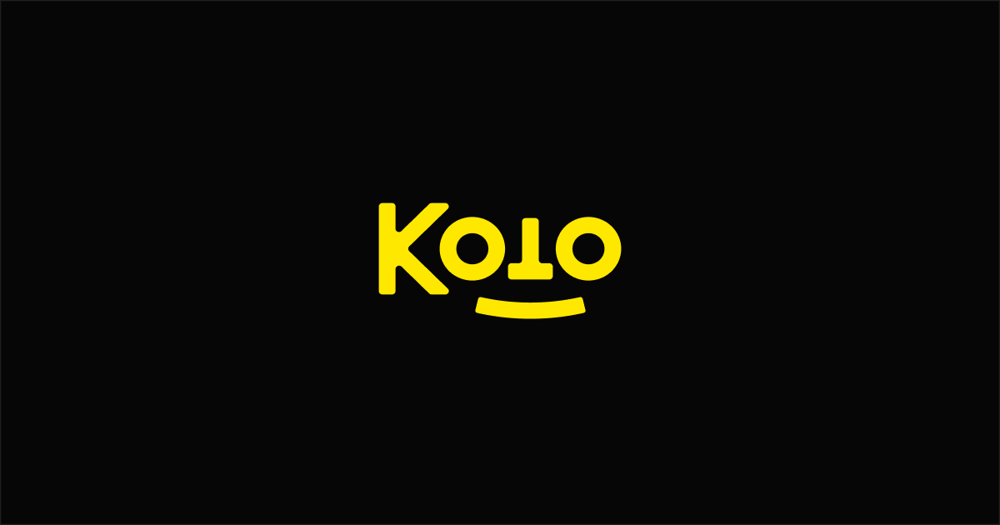

## Summary
​​Meet Koto — a creative studio that partners with brands to shape the future with optimism, collaboration, and craft. Come see what we’re building.

## Key Details
- **Source:** [koto.studio](https://koto.studio/)
- **Title:** Koto, an international creative agency building impactful brands
- **Description:** ​​Meet Koto — a creative studio that partners with brands to shape the future with optimism, collaboration, and craft. Come see what we’re building.

## Visual Assets

