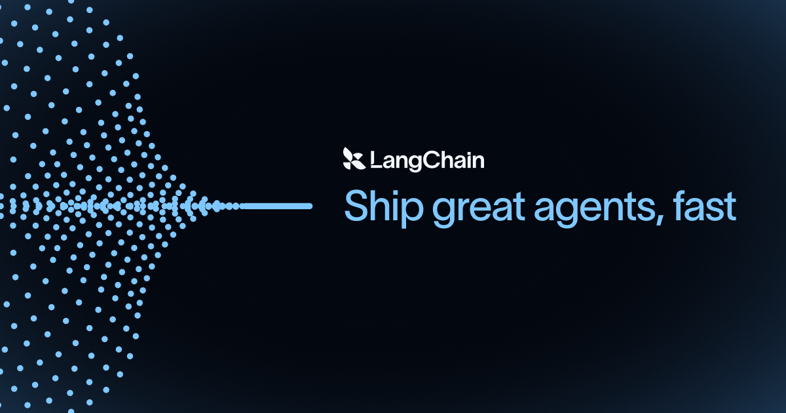

## Summary
LangChain provides the engineering platform and open source frameworks developers use to build, test, and deploy reliable AI agents.

## Key Details
- **Source:** [langchain.com](https://www.langchain.com/)
- **Title:** LangChain provides the engineering platform and open source frameworks developers use to build, test, and deploy reliable AI agents.
- **Description:** LangChain provides the engineering platform and open source frameworks developers use to build, test, and deploy reliable AI agents.

## Visual Assets

