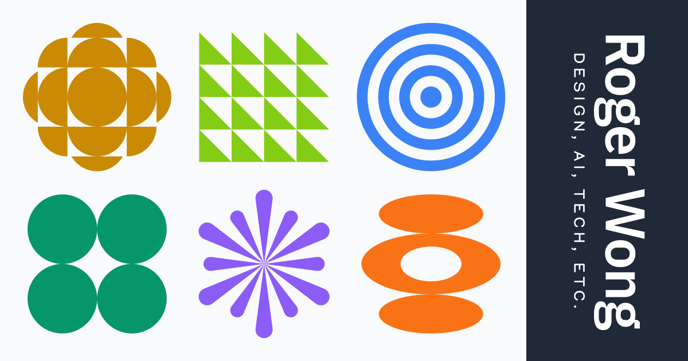

## Summary
The design blog that connects the dots others miss. Written by Roger Wong.

## Key Details
- **Source:** [rogerwong.me](https://rogerwong.me/)
- **Title:** Latest Posts - Roger Wong
- **Description:** The design blog that connects the dots others miss. Written by Roger Wong.

## Visual Assets

