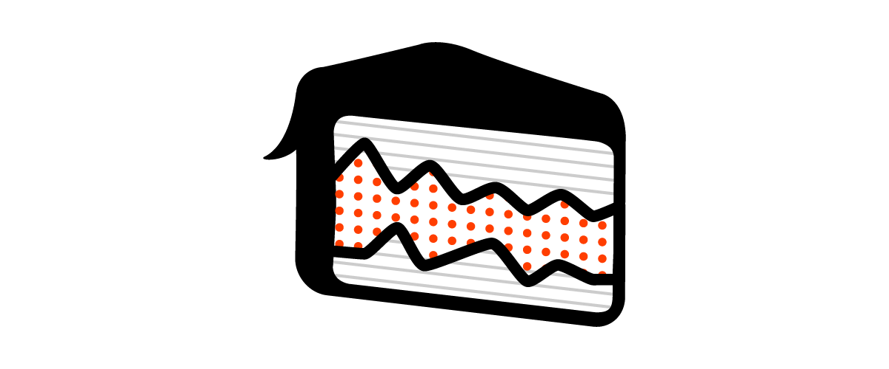

## Summary
A framework for mostly-reusable graphics with svelte

## Key Details
- **Source:** [layercake.graphics](https://layercake.graphics/)
- **Title:** Layer Cake
- **Description:** A framework for mostly-reusable graphics with svelte

## Visual Assets

