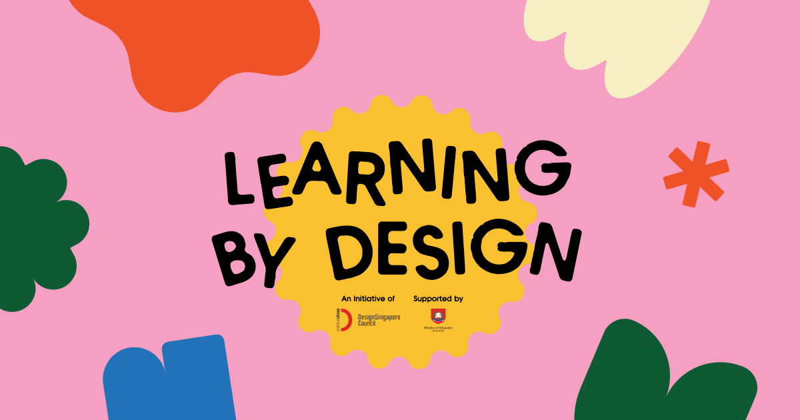

## Summary
Join a Design Thinking Course to empower creativity, problem-solving, and innovation in education for students and professionals alike.

## Key Details
- **Source:** [iamlearningbydesign.sg](https://iamlearningbydesign.sg/)
- **Title:** Learning by Design | An Initiative by DesignSingapore Council
- **Description:** Join a Design Thinking Course to empower creativity, problem-solving, and innovation in education for students and professionals alike.

## Visual Assets

