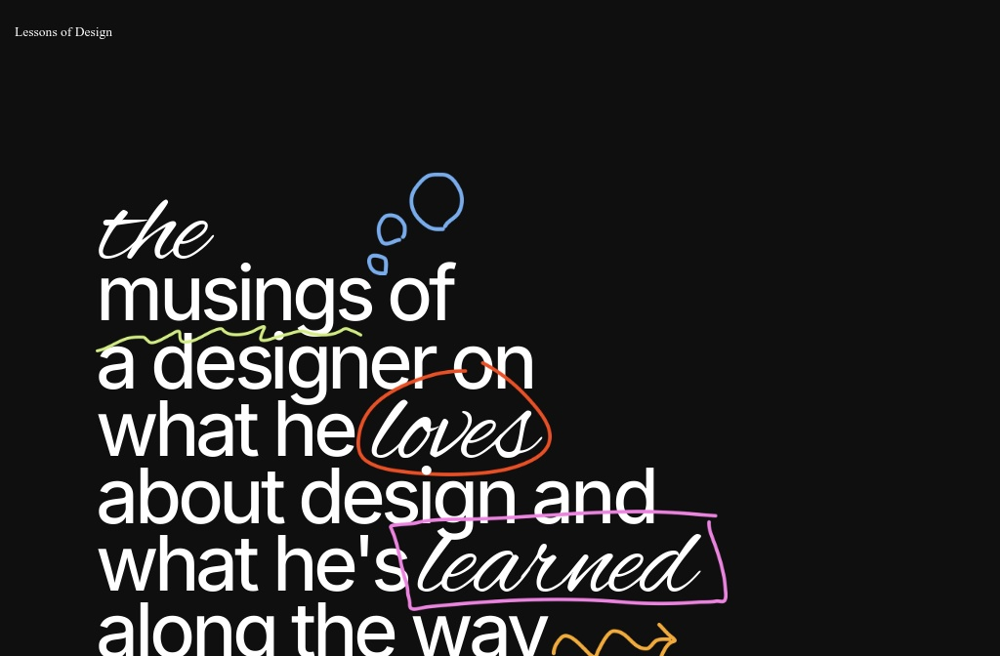

## Summary
The musings of a designer on why he designs the way he does and what he’s learned along the journey.

## Key Details
- **Source:** [lessons.design](https://lessons.design/)
- **Title:** Lessons of Design
- **Description:** The musings of a designer on why he designs the way he does and what he’s learned along the journey.

## Visual Assets

