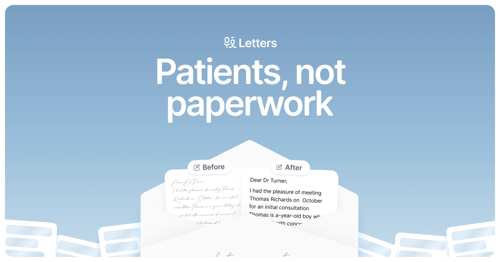

## Summary
Write medical letters instantly that sound like you. Enjoy unlimited, gold-standard transcriptions. Save 5+ hours weekly on paperwork. Letter

## Key Details
- **Source:** [letters.app](https://letters.app/)
- **Title:** Letters - Patients, not Paperwork
- **Description:** Write medical letters instantly that sound like you. Enjoy unlimited, gold-standard transcriptions. Save 5+ hours weekly on paperwork. Letter

## Visual Assets

