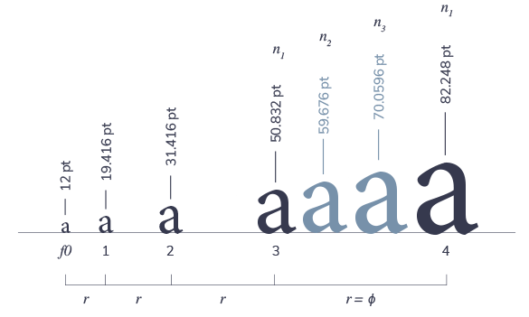

## Summary
A visual typography tool to help you choose the right type scale for your projects. A tool to enhance your typography.

## Key Details
- **Source:** [layoutgridcalculator.com](https://www.layoutgridcalculator.com/type-scale/)
- **Title:** LGC Type Scale - Choose the right font sizes
- **Description:** A visual typography tool to help you choose the right type scale for your projects. A tool to enhance your typography.

## Visual Assets

