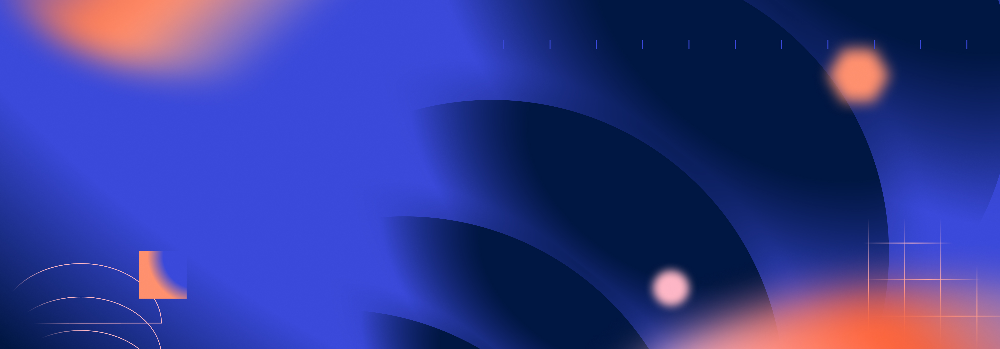

## Summary
Lightning Design System 2 · Design system documentation, made with zeroheight

## Key Details
- **Source:** [lightningdesignsystem.com](https://www.lightningdesignsystem.com/)
- **Title:** Lightning Design System 2
- **Description:** Lightning Design System 2 · Design system documentation, made with zeroheight

## Visual Assets

