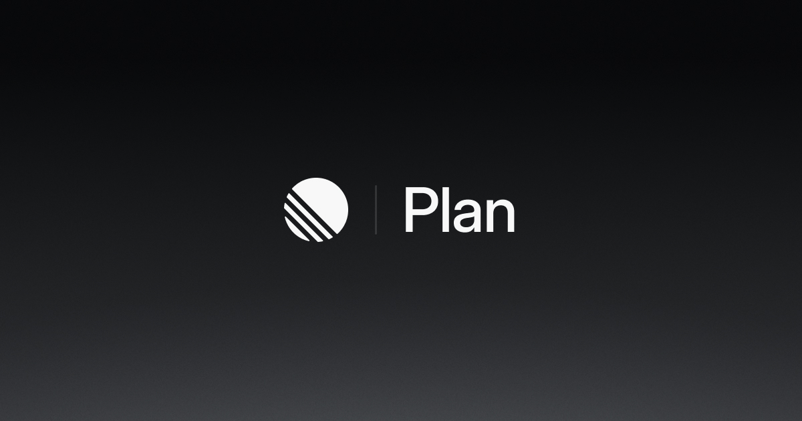

## Summary
Align your teams with projects, initiatives, roadmaps.

## Key Details
- **Source:** [linear.app](https://linear.app/plan)
- **Title:** Linear Plan – Define the product direction
- **Description:** Align your teams with projects, initiatives, roadmaps.

## Visual Assets

