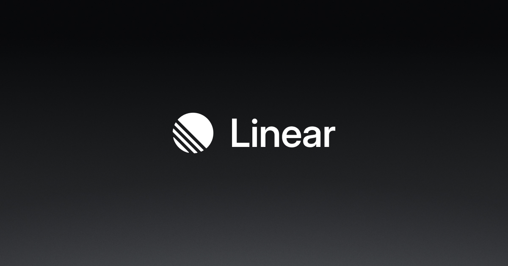

## Summary
Purpose-built for planning and building products with AI agents.

## Key Details
- **Source:** [linear.app](https://linear.app/)
- **Title:** Linear – The system for product development
- **Description:** Purpose-built for planning and building products with AI agents.

## Visual Assets

