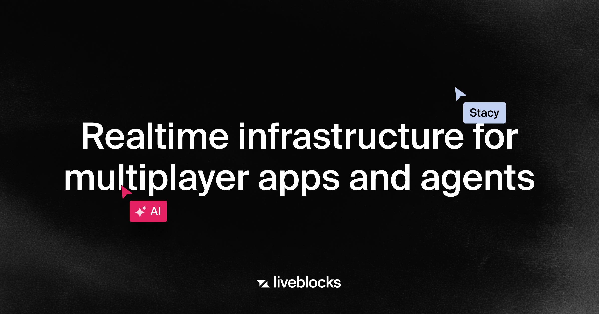

## Summary
Liveblocks provides the infrastructure to handle concurrent edits on shared data, so people and AI agents can collaborate without breaking your app.

## Key Details
- **Source:** [liveblocks.io](https://liveblocks.io/)
- **Title:** Liveblocks | Realtime infrastructure for multiplayer apps and agents
- **Description:** Liveblocks provides the infrastructure to handle concurrent edits on shared data, so people and AI agents can collaborate without breaking your app.

## Visual Assets

