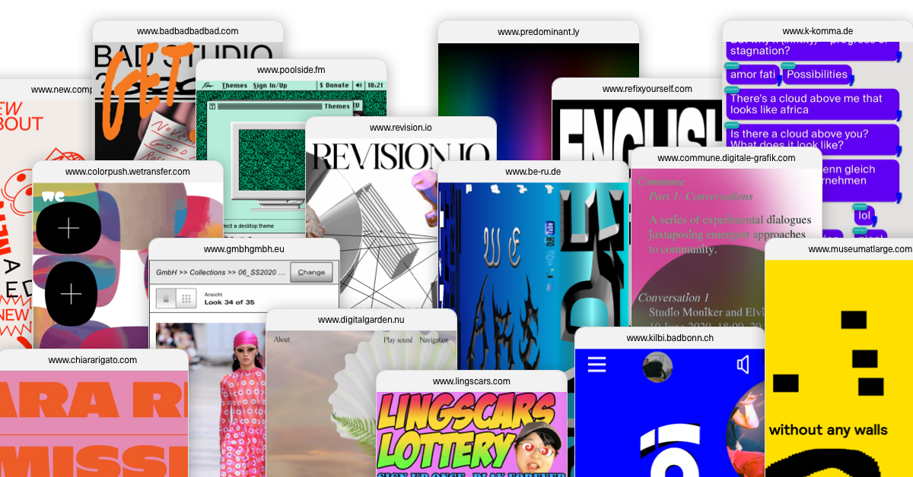

## Summary
A curated archive of distinctive mobile websites and unconventional digital experiences, by Kim Boutin (Kim Lê Boutin). Exploring alternative approaches to mobile-first interface design since 2021.

## Key Details
- **Source:** [loadmo.re](https://loadmo.re/)
- **Title:** loadmo.re — Mobile Web Design Archive by Kim Boutin
- **Description:** A curated archive of distinctive mobile websites and unconventional digital experiences, by Kim Boutin (Kim Lê Boutin). Exploring alternative approach

## Visual Assets

