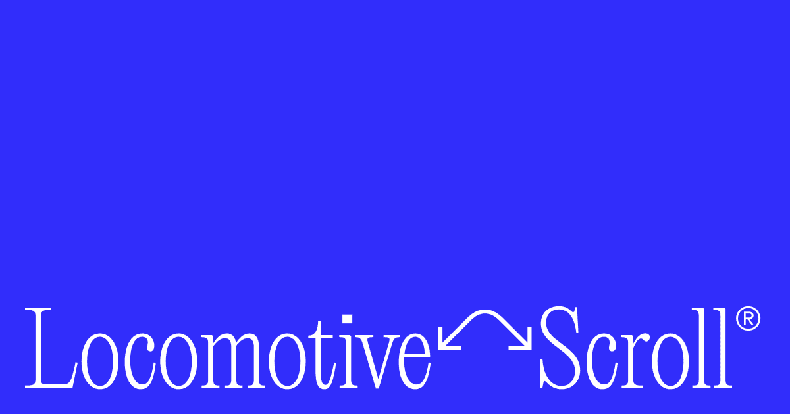

## Summary
Locomotive Scroll is a lightweight JavaScript library that provides smooth scrolling animations and advanced scroll interactions for web applications.

## Key Details
- **Source:** [scroll.locomotive.ca](https://scroll.locomotive.ca/)
- **Title:** Locomotive Scroll — Detection of elements in viewport & smooth scrolling with parallax effects
- **Description:** Locomotive Scroll is a lightweight JavaScript library that provides smooth scrolling animations and advanced scroll interactions for web applications.

## Visual Assets

