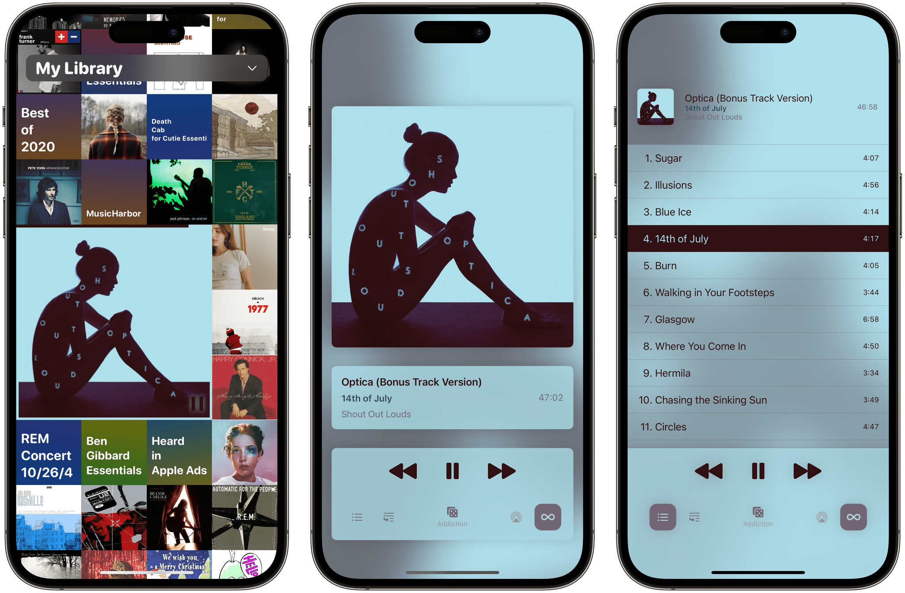

## Summary
Longplay 2.0 by Adrian Schoenig is out, and it's a massive update of the iOS and iPadOS album-oriented music app. If you've tried Longplay before, the update will be familiar. The first time it launch

## Key Details
- **Source:** [macstories.net](https://www.macstories.net/reviews/longplay-2-0-an-album-oriented-apple-music-player-with-loads-of-new-features/)
- **Title:** Longplay 2.0: An Album-Oriented Apple Music Player with Loads of New Features
- **Description:** Longplay 2.0 by Adrian Schoenig is out, and it's a massive update of the iOS and iPadOS album-oriented music app. If you've tried Longplay before, the

## Visual Assets

